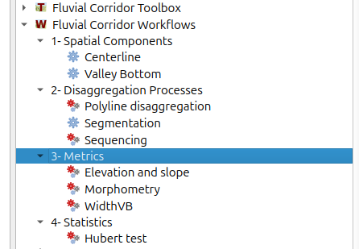

# Fluvial Corridor Toolbox

The Fluvial Corridor Toolbox is a set of geoalgorithms intended to describe and measure fluvial features and processes.

If your are looking for the ArcGIS version of the toolbox,
please go to [Fluvial Corridor Toolbox for ArcGIS](https://github.com/EVS-GIS/Fluvial-Corridor-Toolbox-ArcGIS).

## Supported versions of QGis

This branch is under development and is an open effort to support QGis 3 (currently QGis 3.4).

## Quick start

### Installation

The latest stable release of the Fluvial Corridor Toolbox is now available from the official QGIS plugins repository. 

### Usage

Most of the users will find all the tools they are looking for in the Fluvial Corridor Workflows, in the QGIS Processing panel.

The Fluvial Corridor Workflows are sets of algorithms from the Fluvial Corridor Toolbox prepared to math common users needs like calculating a Valley Bottom from a DEM, creating centerlines of polygons, disaggregate polygons or polylines and calculate metrics.

In the Fluvial Corridor Toolbox, you will find all the detailed algorithms used in the workflow, and many more!

## Acknowledgements

The toolbox is developed within the programme
[Trame bleue, espaces et continuités](https://www.tramebleue.fr/)
in collaboration with :

* [UMR 5600 Environnement, ville et société](http://umr5600.cnrs.fr/fr/accueil/).
* [GeoPeka](http://www.geopeka.com)

Funding and support have been kindly provided by :

* [European Union](http://www.europe-en-france.gouv.fr/Centre-de-ressources/Actualites/Le-FEDER-qu-est-ce-que-c-est)
  and [Région Auvergne-Rhône-Alpes](https://www.auvergnerhonealpes.fr/)
* [Association nationale pour la recherche technologique](http://www.anrt.asso.fr/fr)
* [Agence de l'eau Rhône-Méditerranée-Corse](https://www.eaurmc.fr/)

## License

The Fluvial Corridor Toolbox is released under the [GNU Public License](https://github.com/EVS-GIS/fct-qgis/blob/master/LICENSE).
